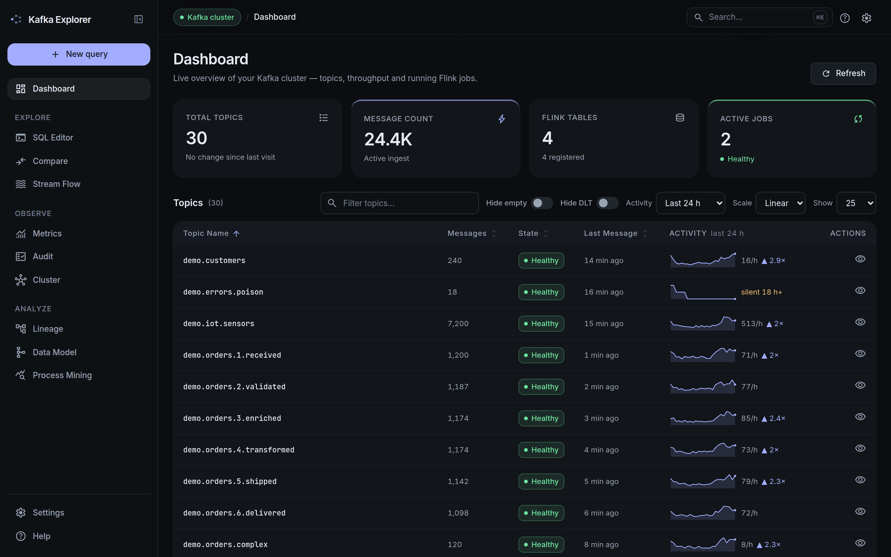
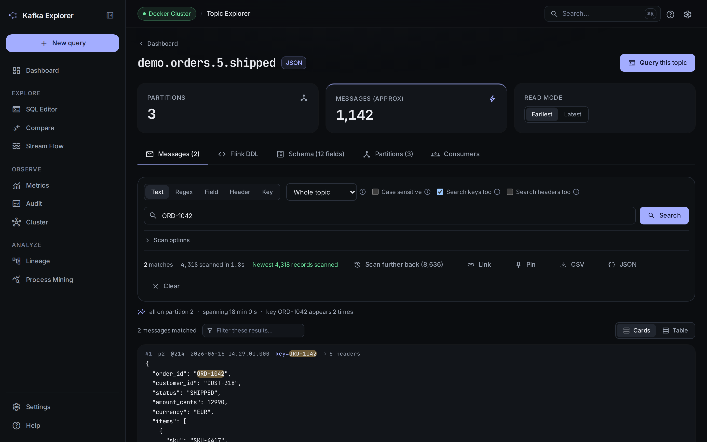
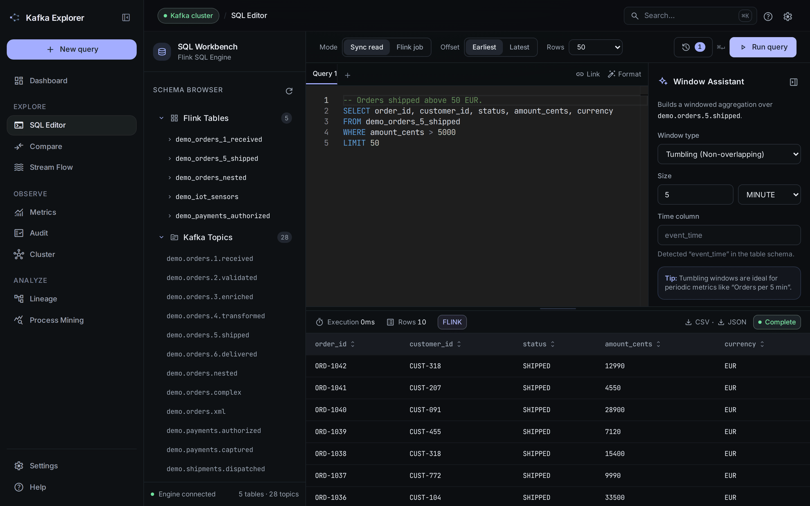
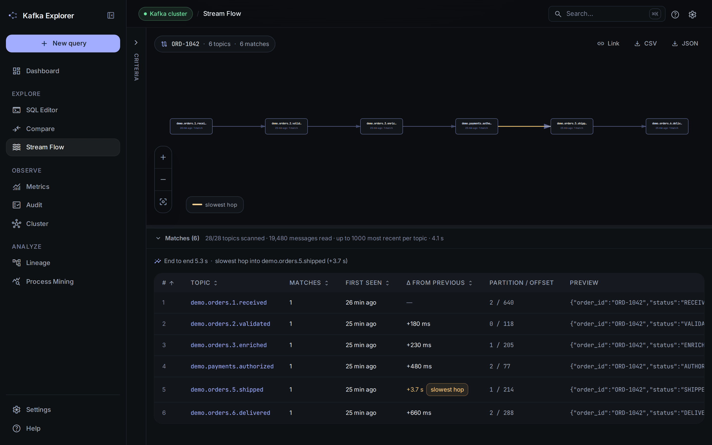
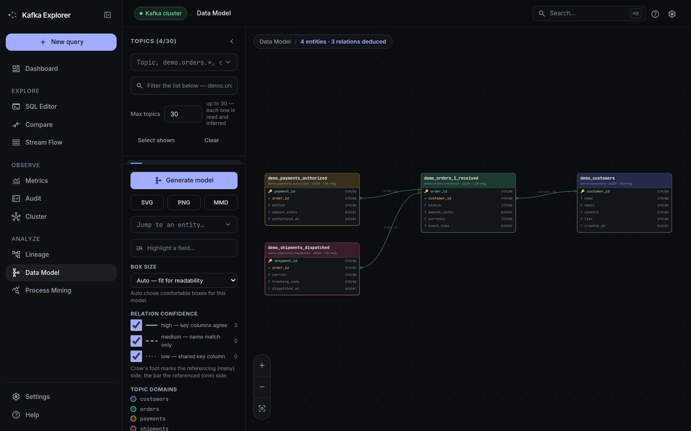
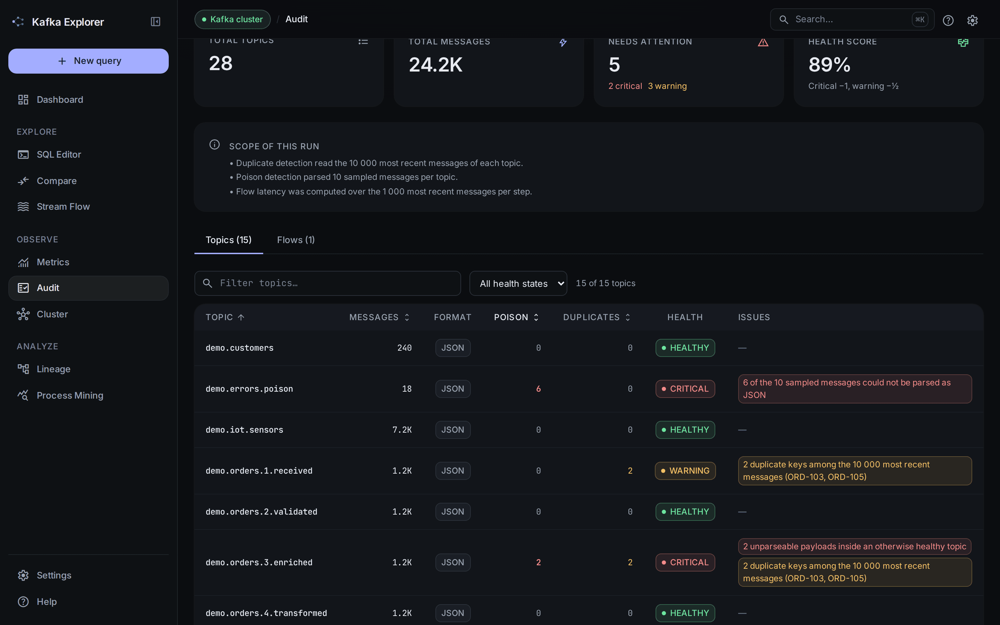
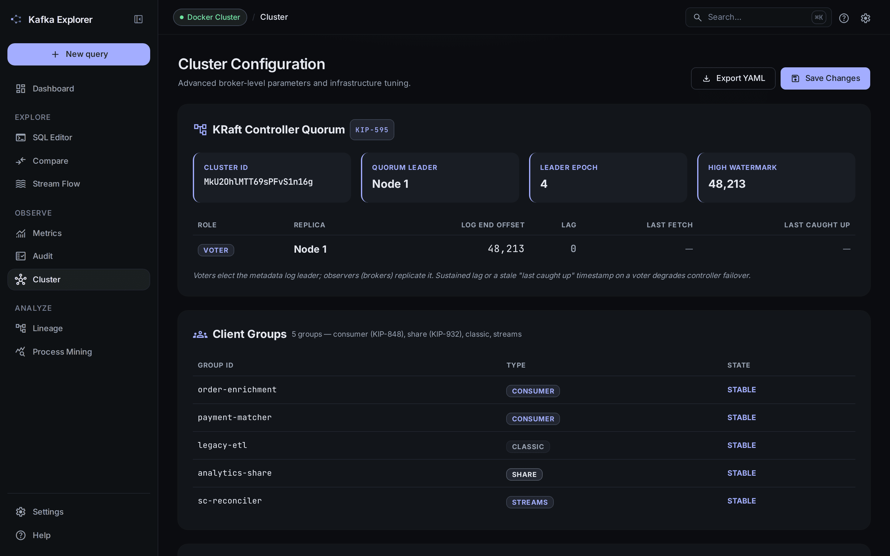

<div align="center">

# ⚡ Kafka SQL Explorer

### Voyez votre Kafka. Interrogez-le comme une base de données. Auditez-le avec l'IA.

[](https://github.com/devdownin/Kafkaexplorer/actions/workflows/ci.yml)
[](LICENSE)
[](https://scorecard.dev/viewer/?uri=github.com/devdownin/Kafkaexplorer)
[](https://hub.docker.com/r/compagnonsdudev/kafkaexplorer)
[](https://github.com/devdownin/Kafkaexplorer/pkgs/container/kafkaexplorer)
[](pom.xml)
[](https://kafka.apache.org/)
[](https://flink.apache.org/)
[](CONTRIBUTING.md)

[Site web](https://devdownin.github.io/Kafkaexplorer/) · [Tour des fonctionnalités](docs/FEATURES.md) · [Démarrage rapide](#-démarrage-rapide) · [Contribuer](CONTRIBUTING.md) · [🇬🇧 English](README.md)

</div>

---

**Arrêtez de plisser les yeux devant un console consumer.** Kafka SQL Explorer est une application web qui transforme n'importe quel cluster Kafka en quelque chose que l'on peut *voir et interroger* : parcourez les topics, cliquez sur un champ d'un message, et obtenez une requête Flink SQL prête à exécuter — pas de DDL à écrire, pas de schéma à deviner, pas de gymnastique CLI. Un JAR, une URL, zéro installation côté cluster.

Pensé pour les data engineers, les architectes, et tous ceux qui se sont un jour demandé *« qu'est-ce qui circule vraiment dans ce topic ? »*



<details>
<summary>Autres écrans — Topic Explorer, Éditeur SQL, Stream Flow, Modèle de données, Audit, Cluster</summary>

**Topic Explorer** — cherchez dans tout le topic, et lisez ce qui a réellement été couvert.


**Éditeur SQL** — Monaco, complétion limitée aux tables citées, et le moteur qui a répondu affiché sur le résultat.


**Stream Flow** — une clé d'enregistrement à travers le cluster, avec la latence de chaque saut et un tableau de preuves vérifiable.


**Modèle de données** — les topics lus comme des tables, avec les relations entre eux déduites et graduées.


**Audit du cluster** — constats gradués, et chaque run énonce son propre périmètre.


**Cluster** — quorum de contrôleurs KRaft, groupes clients, versions de fonctionnalités.


Ces captures sont générées, pas prises à la main : `docs/screenshots/` pilote le SPA compilé au-dessus de réponses d'API figées, calquées sur le jeu de données de démo. Voir son [README](docs/screenshots/README.md) pour les régénérer après un changement d'UI.

</details>

## ✨ Points forts

- 🖱️ **Cliquer, c'est requêter** — cliquez sur une clé JSON ou une balise XML dans l'aperçu d'un message et elle atterrit dans votre `SELECT`/`WHERE`, `JSON_VALUE`/XPath générés pour vous.
- 🧠 **Schémas sans configuration** — les topics sont échantillonnés, leur structure inférée (JSON, XML, Avro via Schema Registry) et enregistrée comme table Flink en un clic.
- 📝 **Un vrai éditeur SQL** — Monaco (le moteur de VS Code), auto-complétion des topics et tables, historique de requêtes, lecture earliest/latest.
- 🕸️ **Lignage & traçage** — un graphe interactif topics → tables → jobs actifs, résolu par le parseur de Flink lui-même ; plus le traçage d'un message à travers les topics par clé, header, JSONPath ou XPath, qui affiche ses sauts au fil de la recherche, dit exactement ce qu'il a lu, reprend là où le budget l'a arrêté, et compare deux clés côte à côte.
- 🗺️ **Un modèle de données que vous n'avez pas eu à dessiner** — choisissez des topics et lisez-les comme des tables, avec les relations entre elles déduites des noms de colonnes clés. Kafka n'a pas de clés étrangères : chaque arête est donc une affirmation, qui porte son grade de confiance, énonce son évidence en toutes lettres, et s'ouvre en `JOIN` prêt à l'emploi — une relation ou tout un sous-graphe.
- 🩺 **Audit du cluster en un clic** — messages toxiques, doublons, pertes en ligne et latence des flux, calculés sur tout le cluster en tâche de fond.
- 🤖 **Process mining assisté par IA** — reconstruisez vos flux métier en flowcharts et traquez les anomalies avec Claude, un LLM local (Ollama…) ou un [SpectraLLM](https://github.com/devdownin/SpectraLLM) privé.
- 🔭 **Nativement Kafka 4** — quorum de contrôleurs KRaft, groupes KIP-848, share groups (KIP-932) et versions de features, visibles dans l'UI et exportés vers Prometheus.
- 🎁 **Un bac à sable inclus** — 76 topics de démo créés automatiquement, du pipeline de commandes en 6 étapes à la supply chain de 60 topics, tous avec clé de record et headers : une commande à tracer à travers les partitions, une corrélation qui ne vit que dans les headers, une vraie série temporelle à fenêtrer, des doublons et des messages poison pour l'audit.

## 🚀 Démarrage rapide

Une seule commande — Kafka 4.3 (KRaft), l'application et tous les topics de démo :

```bash
docker compose up -d
```

Ouvrez ensuite **http://localhost:8080** et commencez à cliquer. C'est tout.

<details>
<summary>Autres façons de lancer</summary>

- **Avec Confluent Schema Registry** (topics Avro) : `docker compose -f docker-compose-kafka4.yml up -d`
- **Avec un LLM local pré-câblé** (Ollama) : `docker compose -f docker-compose-llm.yml up -d`
- **Avec une IA privée à côté** (SpectraLLM, images seules — aucun checkout, aucune construction) : `docker compose -f docker-compose-spectra-hub.yml up -d` — l'explorateur sur 8080, l'interface SpectraLLM sur 8088. Le premier démarrage télécharge ~4,8 Go de poids en arrière-plan, et rien ne l'attend. Des overlays voisins ajoutent le GPU (`.gpu.yml`), les limites mémoire (`.limits.yml`), ou font indexer les topics eux-mêmes par SpectraLLM (`.ingest.yml`).
- **Depuis les sources** (JDK 25) : lancez Kafka avec `docker compose up -d kafka`, puis `./mvnw spring-boot:run`
- **Builder sans rien installer d'autre que Docker** — ni JDK, ni Maven, ni Node :
  ```bash
  docker compose -f docker-compose-build.yml run --rm verify    # le gate complet, comme la CI
  docker compose -f docker-compose-build.yml run --rm package   # le JAR dans ./target
  docker compose -f docker-compose-build.yml run --rm frontend  # ESLint + Vitest seuls
  ```
- **Stack de dev avec rechargement à chaud** (backend + Vite + Kafka, toujours sans installation locale) : `docker compose -f docker-compose-dev.yml up`
- **Image précompilée** (Docker Hub ou GHCR, même image, `linux/amd64` + `linux/arm64`) :
  ```bash
  docker run -p 127.0.0.1:8080:8080 -e KAFKA_BOOTSTRAP_SERVERS=votre-broker:9092 compagnonsdudev/kafkaexplorer:latest
  # ou : ghcr.io/devdownin/kafkaexplorer:latest
  ```
  Tags, variables d'environnement, volumes et sondes : **[docs/DOCKERHUB.md](docs/DOCKERHUB.md)** — la page publiée comme [présentation Docker Hub](https://hub.docker.com/r/compagnonsdudev/kafkaexplorer).
- **Sur votre propre cluster** : pointez `kafka.bootstrap-servers` vers n'importe quel broker Kafka 2.1+ (PLAIN, SSL ou Confluent Cloud) — rien à installer côté cluster.

</details>

## 🧭 Le tour du propriétaire

| Vous voulez… | Direction… |
|---|---|
| Parcourir topics, partitions, volumes et messages | **Dashboard** & **Topic Explorer** |
| Écrire et exécuter du SQL sur les topics | **SQL Editor** — ou cliquez sur les champs et laissez-le s'écrire tout seul |
| Comparer deux topics côte à côte, diff par ID | **Compare** |
| Suivre un message à travers tout un pipeline | **Stream Flow** |
| Visualiser topics → tables → jobs en cours | **Lineage** |
| Lire un ensemble de topics comme un diagramme entité-relation | **Data Model** — relations déduites, graduées, ouvrables en SQL |
| Transformer du SQL en métriques Prometheus avec graphiques | **Metrics** |
| Se voir proposer des KPI tirés de ce que le cluster a montré | **Metrics** — proposés d'après l'audit et les traces |
| Vérifier la santé de tout le cluster en un clic | **Audit** |
| Inspecter brokers, quorum KRaft, groupes clients, feature flags | **Cluster** |
| Laisser un LLM reconstruire et auditer vos flux métier | **Process Mining** |

Chaque fonctionnalité en détail : **[docs/FEATURES.md](docs/FEATURES.md)** · Requêtes prêtes à l'emploi : **[docs/QUERY-EXAMPLES.md](docs/QUERY-EXAMPLES.md)**

## 🤖 Apportez votre IA

Le Process Mining fonctionne avec le LLM que vous avez déjà — **Claude (Anthropic)**, tout ce qui parle l'API OpenAI (**Ollama**, vLLM, LM Studio…), ou un **SpectraLLM** entièrement privé avec RAG, où aucun octet ne quitte votre réseau. Fournisseur, modèle et test de connectivité se configurent en direct depuis l'interface.

→ **[Guide des fournisseurs LLM](docs/LLM-PROVIDERS.md)** *(en anglais)*

## 🛠️ Sous le capot

Un unique JAR Spring Boot 4.1 embarquant Apache Flink 2.3 comme moteur SQL, avec un frontend React 19 + Tailwind. Clients Kafka 4.3 (compatibles brokers 2.1+), Avro via Confluent Schema Registry, métriques Prometheus sur `/actuator/prometheus`. Le SQL est restreint par liste blanche (`SELECT` / `EXPLAIN` / `CREATE TABLE` uniquement), le parsing XML est durci contre les attaques XXE, et les secrets sont masqués dans tout DDL affiché par l'UI.

Plongée dans l'architecture : **[docs/architecture.md](docs/architecture.md)**

## 🏗️ Build et Développement

Il y a plusieurs façons de builder et de travailler sur le projet, selon vos besoins.

### 1. Build de production Docker (Recommandé)
Le projet utilise un build Docker "multi-stage" optimisé qui sépare le front et le back pour une meilleure mise en cache, puis package le tout dans un JRE ultra-léger :
```bash
docker build -t kafka-sql-explorer:latest .
```

### 2. Environnement de Développement (Hot-Reload)
Pour développer avec rechargement à chaud (Hot Module Replacement pour le frontend via Vite et rechargement de classe pour le backend via Spring Boot DevTools) :
```bash
docker-compose -f docker-compose-dev.yml up --build
```
- Le **frontend** sera accessible sur `http://localhost:5173`
- Le **backend** API sera sur `http://localhost:8080` (proxyfié automatiquement par le front)

### 3. Build standard (localement)
Si vous souhaitez compiler l'intégralité du projet localement (sans Docker pour la compilation), Maven s'occupera de tout via un profil activé par défaut (téléchargement de Node, build du React, et packaging Spring Boot) :
```bash
./mvnw clean package
```
## 🏗️ Build et Développement

Il y a plusieurs façons de builder et de travailler sur le projet, selon vos besoins.

### 1. Build de production Docker (Recommandé)
Le projet utilise un build Docker "multi-stage" optimisé qui sépare le front et le back pour une meilleure mise en cache, puis package le tout dans un JRE ultra-léger :
```bash
docker build -t kafka-sql-explorer:latest .
```

### 2. Environnement de Développement (Hot-Reload)
Pour développer avec rechargement à chaud (Hot Module Replacement pour le frontend via Vite et rechargement de classe pour le backend via Spring Boot DevTools) :
```bash
docker-compose -f docker-compose-dev.yml up --build
```
- Le **frontend** sera accessible sur `http://localhost:5173`
- Le **backend** API sera sur `http://localhost:8080` (proxyfié automatiquement par le front)

### 3. Build standard (localement)
Si vous souhaitez compiler l'intégralité du projet localement (sans Docker pour la compilation), Maven s'occupera de tout via un profil activé par défaut (téléchargement de Node, build du React, et packaging Spring Boot) :
```bash
./mvnw clean package
```
## 🤝 Contribuer

Les contributions sont bienvenues — le code est volontairement très commenté pour servir aussi de ressource d'apprentissage sur l'intégration Flink SQL + Spring Boot.

Lancez **`mvn verify`** avant d'ouvrir une pull request : c'est la porte complète — tests Java, ESLint et Vitest — et c'est exactement ce que fait la CI. `mvn test` est la boucle rapide côté back et ne lance *pas* les vérifications du front.

- Lisez le **[guide de contribution](CONTRIBUTING.md)** pour démarrer
- Restez bienveillants : **[Code de conduite](CODE_OF_CONDUCT.md)**
- Besoin d'aide ou une question ? **[Support](SUPPORT.md)**
- Ce qui change d'une version à l'autre : **[Changelog](CHANGELOG.md)**
- Une faille de sécurité ? Suivez la **[politique de sécurité](SECURITY.md)**

## 📄 Licence

[AGPL v3](LICENSE) — libre d'utiliser, d'étudier, de partager et d'améliorer.

---

<div align="center">
<sub>© 2026 Kafka SQL Explorer — Compagnons du dev. Si ce projet vous épargne une après-midi de debug, une ⭐ nous fait toujours plaisir.</sub>
</div>
