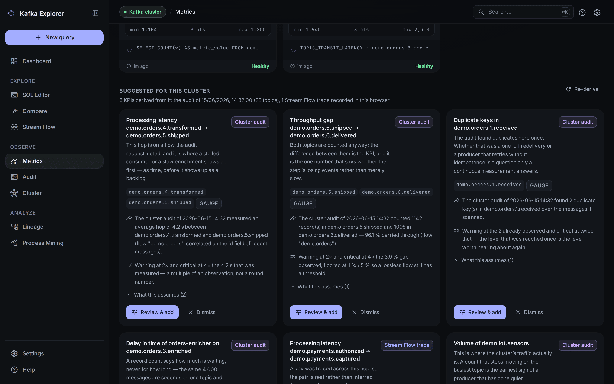
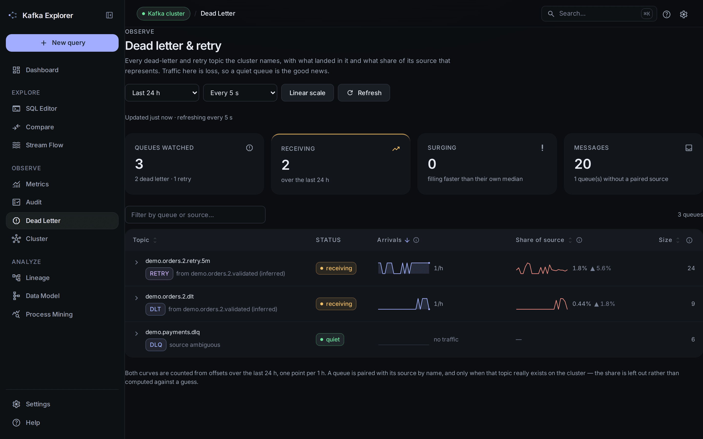

# Feature Tour

The complete guided tour of everything Kafka SQL Explorer does. For the short version, see the [README](../README.md).

> The screenshots below are generated, not photographed: [`docs/screenshots/`](screenshots/README.md) drives the compiled interface over canned API responses shaped like the dataset `setup-demo.sh` seeds. The UI is real; only the data is fixed. Re-run it after a UI change rather than re-photographing.

## 1. Dashboard & Navigation
- **Topic List**: Overview of all topics available on the Kafka cluster.
- **Advanced Filtering**:
  - **Prefix Filter**: Allows quickly finding topics belonging to a domain (e.g., `order.*`).
  - **Full Name Match**: Exact search to isolate a specific topic.
  - **DLT Filtering**: Toggle to hide Dead Letter Topics (`*.dlt`) and focus on functional streams.
- **Flink Dynamic Tables**: Dedicated section to manage temporary tables and views registered in the local Flink engine.
- **Command Palette**: `⌘K` / `Ctrl+K` global search over pages, quick actions, Kafka topics and Flink tables.

## 2. Topic Exploration
- **Real-Time Metadata**: Visualization of the number of partitions, min/max offsets, and estimated data size.
- **DLT Identification**: Specific badges and warnings for Dead Letter Topics, alerting about potentially malformed data.
- **Sampling**: Automatic reading of the latest messages from the topic (partition 0) for analysis.
- **Advanced Formatting**: Native pretty-print for messages in **JSON** and **XML** formats.
- **Quick Copy**: One-click copy button for each previewed message.

## 3. Query Assistant (Integrated Intelligence)
The assistant transforms the message preview into a query design tool:
- **Interactive Selection**: Click on a JSON key or an XML tag to automatically add it to the `SELECT` clause.
- **Dynamic Filters**: Click on a value to add it to the `WHERE` clause.
- **Comparison Operators**: Dynamically choose the operator (`=`, `!=`, `LIKE`, `>`, `<`) for your filters.
- **Support for Nested Paths**: Automatic generation of `JSON_VALUE` for complex JSON structures.
- **XML Extraction**: Use of the custom `XmlExtract` function (based on XPath) to query XML payloads.
- **One-Click Registration**: "Register Table" button to instantly execute the generated DDL.

## 4. Professional SQL Editor
- **Monaco Editor**: High-performance SQL editor (VS Code engine) with SQL syntax highlighting and Cyberpunk theme.
- **Read Mode Switch**: Toggle between **Earliest** (start from beginning) and **Latest** (new messages only) offsets directly in the UI.
- **Dynamic SQL Hints**: Automatic injection of Flink SQL hints (`/*+ OPTIONS(...) */`) for per-query offset control without DDL changes.
- **Auto-completion**: Intelligent suggestion of topic names and registered tables (`Ctrl+Space`).
- **Query History**: Quick access to recent and saved queries, persisted in the browser (localStorage).
- **Resource Management**: Automatic cancellation of Flink jobs in case of timeout or error, preventing any resource leak in the minicluster.

## 5. Visual Query Lineage
- **Interactive Graph**: A custom SVG dependency graph visualizing the relationships between topics, tables, and views. Pointer, touch and keyboard driven (arrows pan, `+`/`−` zoom, `0` resets, Tab moves between nodes, Enter opens one).
- **Resolved by Flink, not guessed**: Dependencies come from Flink's own parser walking the resolved operation tree, so a windowed source (`FROM TABLE(TUMBLE(TABLE orders, …))`), a quoted identifier or a multi-statement script is read correctly. When a statement cannot be resolved — a table that no longer exists — the graph falls back to a lexical scan and **says so** above the graph, because a missing edge and an absent dependency look identical.
- **Active Job Tracking**: Real-time visualization of running `INSERT INTO` queries as nodes connecting source and target tables.
- **Node Inspector**: Click on any node to view detailed information, such as the table schema or topic type.

## 6. Message Propagation (Stream Flow)
- **Message Tracing**: Trace the path of a specific message across multiple Kafka topics by searching for a key or pattern.
- **Advanced Targeting**: A dot path (`order.items[].sku`), **JSONPath** (`$..id`), **XPath** (`/order/id`) or a single Kafka header (`header:correlation-id`). Left empty, the search covers the record key, the payload and every header — a correlation id very often travels only in a header.
- **Exact Record Key**: Compares the whole Kafka key and scans only the partition the default partitioner would have chosen — a fraction of the work, and what "find record X" actually means.
- **Regular Expression Support**: Flexible matching using standard regex syntax. An invalid regex or a malformed path is rejected with its reason, never silently degraded into a substring search.
- **Time-Based Filtering**: Narrow the search to a time window. Topics whose newest record predates the window are skipped outright and named — nothing inside the window could have matched them.
- **Parallel Scanning**: Concurrent scanning with managed resource limits. Without target topics, the **most recently active** topics are read first, up to `explorer.stream-flow-max-topics`.
- **Streamed Results**: Hops appear on the graph as they are found, with live progress; stopping the scan keeps what was found rather than discarding it.
- **Honest Coverage**: Every trace states how many topics and messages were read, why it stopped, and *which* topics were never reached. An empty result reads as "not in the window I scanned", never as a bare "not found".
- **Continue, don't restart**: A trace stopped by its time budget resumes on the topics it never read, merging the new hops into the same chain.
- **Compare Two Traces**: Put two keys side by side — shared topics, topics only one of them reached, and the per-hop latency difference. Hop latencies are compared, never absolute timestamps: two keys processed an hour apart have nothing to say to each other in the absolute.
- **Chronological Visualization**: Interactive graph of the chain, with the slowest hop and any clock skew marked. Pointer, touch and keyboard driven (arrows pan, `+`/`−` zoom, `0` fits, Tab moves between nodes).
- **Shareable & Exportable**: The whole criterion round-trips through the URL, so a trace pasted into an incident ticket reruns exactly as it was. Hops export to CSV, or to JSON carrying the criterion, the coverage and the warnings.
- **Two-Way Links**: A hop opens the Topic Explorer on the same search; a message in the Topic Explorer traces its key across the cluster. The command palette (⌘K) offers to trace any text that is not a known topic.

## 7. Data Model (Deduced Entity-Relation Diagram)
Pick a set of topics and read them as a schema. Each topic becomes an entity card carrying its inferred columns; the relations between them are deduced from key-column names and drawn in crow's-foot notation between the exact column rows they connect.

- **Every edge is a claim, and says so**: Kafka has no foreign keys, so a relation is graded `HIGH` (the referencing column and the target's own key agree), `MEDIUM` (a name match alone) or `LOW` (only a shared key column), and carries the evidence in plain words. The line style means confidence and nothing else — cardinality is carried by the crow's foot, so the two never compete for the same channel.
- **The key column is detected, never invented**: an entity with no id-like field simply has no key. Words merely ending in "id" (`paid`, `valid`) are not identifiers, and a name echoing its own topic (`order_id` on an orders topic) is identity rather than a reference.
- **A column that reads as a foreign key but produced no relation is flagged** (`?`), rather than being indistinguishable from an ordinary column — a diagram that looks incomplete should say why it is. The message states only what is checkable: no selected topic carries that name.
- **The confidence legend is also the filter**: each grade is a checkbox with its count, so a model rich in name-only matches stops drowning the edges the target's own key actually supports. It hides lines without rearranging the diagram, and a relation hidden from the graph is still listed in the inspector, marked.
- **A relation opens as a query**, and so does a subgraph: a `HIGH` relation *is* a join predicate, and this is the only place in the application where that predicate is already known. Add several entities to a join set and get one query joining all of them, built so every `JOIN` predicate cites a table already introduced. It **refuses rather than inventing a predicate** — a set the deduced relations do not connect has no join, and the entity that cannot be reached is named.
- **Reading a large model**: entity headers are tinted by topic domain, entities no relation touches are set aside rather than diluting the graph (counted, still inspectable), a minimap appears *only* when the graph overflows the viewport, and a "jump to an entity" search centres one by name. A field-highlight box answers "who else carries this key?" without a request.
- **Shareable, saveable, exportable**: the selection round-trips through the URL so a model replays on open; named selections are kept by the browser; and the diagram exports as SVG, PNG or a Mermaid `erDiagram` — the textual one existing for what the images cannot do, be re-read and diffed. Every export carries the coverage line and states what is *not* drawn, because a diagram detached from the app cannot be interrogated.
- **Bounded, and it says so**: 30 topics per run by default and 20 s per topic. The budget is a field on the panel, bounded by a server ceiling (`explorer.data-model-max-topics`, 100) that the page *reads* rather than mirroring — 30 used to be a constant written on both sides, so raising it took a rebuild. A topic that yields no schema or whose read fails costs that topic — reported with its reason — never the model.

## 8. Advanced Topic Comparison
- **Side-by-Side Analysis**: Compare messages from two Kafka topics in independent columns.
- **Shared SQL Template**: Apply identical logic to both topics using a shared Flink SQL editor with `{topic}` placeholder support.
- **Time Synchronization**: Linked time range filters for temporal correlation between datasets.
- **Intelligent Diffing**: Specify an ID column to highlight value discrepancies and identify missing records across topics.
- **Live Metrics**: Real-time display of message counts and throughput (msg/s) for the selected topics and time ranges.

## 9. Automated Functional Audit
- **Asynchronous Auditing**: Launch long-running cluster-wide audits in the background (dedicated executor, bounded per-topic parallelism).
- **Technical Health Checks**: Automatic detection of "poison messages" (malformed JSON/XML) and exact record counting via the direct Kafka SELECT engine.
- **Duplicate Detection**: In-process scan (up to 10 000 messages per topic) counting keys that appear more than once, based on common ID fields (e.g., `id`, `order_id`, `*_id`).
- **Functional Flow Analysis**: Automatic grouping of topics into logical business processes (using naming conventions) to visualize throughput and drop-off rates across steps.
- **Latency Measurement**: Average delta between Kafka record timestamps of messages sharing the same `id` across successive topics in a flow, computed in-process.
- **Audit History**: Persistence of audit reports into a dedicated Kafka topic (`internal.audit.history`) for long-term tracking.

## 10. Security & Robustness
- **XXE Protection**: Strict disabling of external DTD entities for all XML parsers (Schema Inferrer, UDF, Formatter).
- **SQL Validation**: Whitelist of authorized commands (`SELECT`, `EXPLAIN`, `CREATE TABLE`) to prevent destructive DML operations.
- **Credential Masking**: DDL shown in the UI (topic detail, DDL preview, lineage) has SSL passwords and SASL/Confluent secrets redacted.
- **Connection Management**: Clean lifecycle of the Kafka AdminClient, consumers, producers and thread pools; heavy metadata calls are cached (30s) to keep dashboard polling cheap.
- **Guarded Cluster Repointing**: Changing the Kafka connection while an audit, a Flink job or a live Process Mining session is still running is refused (HTTP 409) and the response names what is running — one report must not describe two clusters. The refusal can be overridden explicitly; what was already running keeps reading the previous cluster.
- **Failures That Stay On Screen**: An error that needs acting on is shown as a panel with the server's own message — readable title, hint, raw text one click away — not a toast that fades in three seconds.

## 11. Process Mining & AI Analysis (LLM)
Kafka Explorer integrates AI to analyze message flows and detect anomalies:
- **Automatic Field Profiling**: Detects `CORRELATION_ID`, `TIMESTAMP`, and `STATUS` fields across topics. A run that **could not happen** — no API key, an endpoint that did not answer, an answer that would not parse — is reported as that, with its cause, rather than as a profiling that found nothing: the two look identical from outside and send you to opposite places, one to the cluster and the other to the model.
- **Flow Reconstruction**: Generates Mermaid flowcharts of your business processes.
- **Anomaly Detection**: Identifies sequence breaks, temporal delays, and structural inconsistencies.
- **Audit checklist**: A built-in library of ready-to-use audit prompts (ordering, duplicates, orphan flows, latency/SLA, schema drift, missing required fields, invalid status transitions, error/retries, amount outliers, PII exposure, correlation integrity). Tick the checks — plus an optional free-form instruction — to focus the LLM on a specific audit, in both snapshot and live modes. Audits that need a field the profiling step didn't detect (e.g. amount outliers with no `AMOUNT` field) are greyed out automatically. Served from `GET /api/process-mining/audit-templates`.
- **Multi-Provider Support**: Compatible with **OpenRouter** (the default — one key in front of most hosted vendors, so `OPENROUTER_API_KEY=sk-or-v1-…` is the whole setup), **Claude (Anthropic)**, **Open Source models** (via OpenAI-compatible APIs like Ollama), and **SpectraLLM** (self-hosted private RAG/fine-tuned models — `compose/spectra-hub.yml` runs the pair from published images, nothing built locally, with overlays for a GPU, memory limits, or having SpectraLLM index the topics themselves — and a smaller 3B model for a laptop via four `.env` lines). See the [LLM provider guide](LLM-PROVIDERS.md). On OpenRouter you need not know a model's name: Settings lists the models that fit this deployment — text output, schema support, a context window large enough for the prompt budget — cheapest first, with what each would cost per analysed window, and **Test tries one without saving it**.
- **It says what leaves your machine, and what it cost**: both pages that call a model state which of four cases applies — it stays on this host, no retention (enforced by OpenRouter's routing), retention allowed, or governed by the endpoint's own terms — and a policy is only asserted where this application can actually impose it. Beside it, the tokens and the **real price** the provider reported for the call and for the run — never an estimate, and the one projected figure that does exist, on the model picker, says so where it is shown; a live session can be given a spend cap (`CLAUDE_SESSION_COST_LIMIT_USD`) and stops itself when it is reached.

## 12. Demo & Sandbox Environment
`setup-demo.sh` seeds **79 topics** automatically (81 with Schema Registry), so every feature on this page has a dataset to run against. Each stack runs it for you — `docker compose up -d` and it is there. It seeds once and skips afterwards, but the skip is checked against the **data** and not only against the marker topic that records it: a topic never expires and the records it vouches for do, so a stack brought back up past their retention would otherwise come back with every topic name and nothing in any of them.

Every business record carries a **record key** and **Kafka headers** (`correlation-id`, W3C `traceparent`, `source-system`, `event-type`, `produced-at`). Without them, exact-key tracing, key-partition narrowing, header search, log compaction and the audit's key-based duplicate detection would have nothing to run against.

- **6-Step Order Pipeline**: Sequential topics (`demo.orders.1.received` to `6.delivered`), **3 partitions each**, keyed by order id. `ORD-101` walks all six steps with a real pause between hops — the 3 → 4 hop is deliberately three times slower, so **Stream Flow** has a genuine bottleneck edge to highlight. `ORD-102` is rejected at step 2, giving the flow a drop-off.
- **Header-only correlation**: `demo.payments.authorized` / `.captured` and `demo.shipments.dispatched` / `.delivered` carry their own `PAY-…` / `SHP-…` references and **never mention the order id in their payload** — only in the `correlation-id` header. Trace `ORD-101` and they join the chain if, and only if, *search headers too* is on.
- **Key partitioning**: `demo.orders.nested` has **6 partitions** and is keyed by order id, so *only this key's partition* on an exact-key search visibly narrows the scan (murmur2 routing) instead of being a no-op on a single-partition topic.
- **Real time windows**: `demo.iot.sensors` holds 144 readings from 8 sensors, one per minute over the last ~2h24, with a few out-of-range `ALERT` values. Its `event_time` is genuinely spread, which is what makes `TUMBLE` / `HOP` return several buckets — and what makes a Prometheus **GAUGE / SUMMARY** metric move. `demo.orders.nested` spreads its `event_time` over ~2 hours for the same reason.
- **JOINs & Reference Data**: `demo.customers` is **log-compacted** and keyed by `customer_id`; `C-002` is produced twice, so the topic shows what compaction keeps.
- **XML Processing**: `demo.orders.xml` holds four documents of two shapes — including a nested one with attributes, a contact subtree and a shipping address — to test the `XmlExtract` UDF and XPath predicates.
- **Complex JSON**: `demo.orders.complex` and `demo.orders.nested` (20 documents, 3 levels deep) for **Schema Inference**.
- **Poison Messages**: `demo.errors.poison` covers the four kinds of unreadable the app reports differently — truncated JSON, plain prose, unclosed XML, invalid UTF-8 (flagged as *binary*, which no text search can match) and an empty payload. Two truncated records also sit inside `demo.orders.3.enriched`: a poison check that only ever runs against a topic named "poison" proves nothing, so the **Cluster Audit** reports one CRITICAL topic inside an otherwise green flow.
- **Consumer groups**: two on `demo.orders.1.received` — `demo.orders.processor` is caught up, `demo.orders.reporting` read four records and left, so records wait with no member assigned. That is the STALLED shape the audit grades CRITICAL and the one the delay-in-time KPI is proposed for; before this, a fresh demo cluster had no consumer group at all and four features had nothing to show. The delay in *time* grows on its own while the stack stays up, which is exactly what the metric is about.
- **Duplicates**: `ORD-103` and `ORD-105` are redelivered identically on `demo.orders.1.received`, the way an at-least-once producer retries — the audit's duplicate detection has a real finding instead of a clean-room zero.
- **Avro & Schema Registry** (`compose/schema-registry.yml` only): `demo.avro.orders` and `demo.avro.customers` register a `<topic>-value` subject, which is what makes `AvroSchemaInferrer` classify them as AVRO and derive their columns from the registry rather than from sampling. Seeded by `setup-demo-avro.sh`; it exits cleanly if the registry is unreachable.
- **Supply Chain 2.0 (Complex Process)**: A 20-step massive pipeline (`demo.sc.01.order.placed.out` to `20.delivered.out`) involving 60 topics. It features evolving nested JSON payloads (adding payment, fulfillment, quality control, and logistics data incrementally) to demonstrate advanced **Schema Inference** and **Stream Flow** across complex architectures. Each step is stamped 90 s after the previous one.

Seeding is batched — one producer per topic, not one per message — and topics are created 8 at a time. Two knobs: `DEMO_HOP_DELAY` (seconds between the traced pipeline's hops, default 2; set to 0 for the fastest seeding, at the cost of flat hop latencies) and `DEMO_PARALLEL` (concurrent Kafka CLI processes, default 8).

## 13. Kafka 4 / KRaft Observability
- **KRaft Controller Quorum** (Cluster page): metadata-log leader, epoch and high watermark, plus a voters/observers table with per-replica lag and last fetch / last caught-up timestamps. Hidden automatically on Zookeeper-based clusters.
- **Client Groups** (Cluster page): every registered group with its type — `CLASSIC`, `CONSUMER` (KIP-848), `SHARE` (KIP-932 queues) or `STREAMS` — and state.

- **Feature Versions** (Cluster page): finalized vs broker-supported version for each cluster feature (`metadata.version`, `group.version`, `share.version`, …) with an *Up to date / Lagging* badge.
- **Incomplete-upgrade detection** (Audit page): if the finalized `metadata.version` lags what every broker supports (a rolling upgrade that was never finalized with `kafka-features.sh upgrade`), the audit report raises a dedicated warning banner.
- **Prometheus quorum gauges** (`/actuator/prometheus`): `kafka_quorum_leader_id`, `kafka_quorum_leader_epoch`, `kafka_quorum_high_watermark` and `kafka_quorum_replica_lag{replicaId,role}` — alert on a lagging voter or a controller failover.
- **KIP-848 rebalances**: the live Process Mining consumer uses the next-gen incremental rebalance protocol (`kafka.consumer-group-protocol: consumer`, env `KAFKA_CONSUMER_GROUP_PROTOCOL`), which every bundled Docker stack already set explicitly and which is now the shipped default. It **requires Kafka 4.x brokers** — against an older one, set `classic`, which works with any broker version.

## 14. Metrics & Contextual KPIs
Any query the engine can run becomes a Prometheus series, scraped from `/actuator/prometheus`.

- **Four Prometheus types**: `GAUGE` (point-in-time), `COUNTER` (cumulative, delta-tracked between polls), `HISTOGRAM` (Prometheus-native buckets) and `SUMMARY` (client-side p50/p75/p90/p95/p99). Series are `explorer_metric_{gauge,counter,histogram,summary}`, tagged `metric_id` / `metric_name` / `metric_type` plus every non-`metric_value` column the query returns.
- **Three templates beside raw SQL**: `TOPIC_COUNT_DELTA` (the gap between two topic counts — a silent drop between two steps), `TOPIC_TRANSIT_LATENCY` (the delay between a source and a target topic, correlated on a key) and **`CONSUMER_TIME_LAG`**.
- **Lag in time, not only in records** (`CONSUMER_TIME_LAG`): the age of the oldest message a consumer group has not read. The same 4 000 messages are four seconds of traffic on one topic and four days on another, and only the second wakes somebody — so this is the backlog in the unit an operator acts on. The only template that runs no SQL: the position lives in `__consumer_offsets` and the age is a record timestamp, neither of which is in a payload. Bounded to 64 partitions and an 8 s budget per refresh; a partition whose record could not be read is reported as **unknown, never as zero** — zero means "caught up", and a gauge saying so while nothing could be read silences the alert it exists to raise.
- **The delay is measurable from the Topic Explorer too**: the Consumers tab has a per-group "how long has it been waiting?" button — on a button rather than on load, since it reads a record per lagging partition where the rest of the panel reads metadata. A partition that could not be read shows *not measured*, and a partial measurement says the value is a floor rather than a maximum.
- **Consumer lag in records** is exported separately and without any SQL: name the topics in `explorer.lag-metrics-topics` and Prometheus gets `kafka_consumer_group_lag`, `kafka_consumer_group_assigned_members`, `kafka_consumer_group_partitions_without_commit` and `kafka_consumer_group_lag_last_success_timestamp_seconds` — the last one so an alert can require that the value it fires on was actually measured recently. Setting `explorer.lag-metrics-time` adds `kafka_consumer_group_lag_seconds` for the same topics — the backlog in time. That one is *removed* rather than frozen when a refresh cannot measure it: an age that stops being measured does not stay roughly right the way a count does, it gets more wrong every minute.
- **KPIs suggested from what the cluster was observed doing**: a "Suggested for this cluster" panel derives proposals from four observations: the **cluster audit** (flow hops it timed, throughput drops, duplicates, the busiest topics, consumer findings), **Stream Flow traces** run in this browser (per-hop latency, end-to-end completeness), the **running Flink jobs** (an `INSERT INTO` declares a pipeline edge rather than letting a naming convention guess it — a join is refused, with the reason said), and a validated **Process Mining field mapping** (which names each topic's real correlation key, sharpening every card that needs one, and its status field, which becomes a KPI with one series per status value). Three rules govern it — every card names the run and measurement it rests on; thresholds are multiples of something measured and say which, or there is no threshold at all; and nothing is created, the card opens the editor pre-filled for a preview and an explicit save. With no audit and no trace, the panel says nothing has been measured yet and links to the two pages that change that, rather than concluding the cluster needs no KPI.
- **Live charts and status**: each metric card shows its recent history, its warning/critical thresholds and why it is pending — the usual cause being a missing `AS metric_value` alias, not a resource problem.

## 15. Dead Letter & Retry Supervision
A page of its own for the topics named `.DLQ`, `.DLT` or `retry` — because they are the one family
this application must read backwards. Everywhere else a curve that climbs is a sign of life; on a
failure queue it is loss, and a silent queue is the good news. The dashboard lists these topics
among the others, sorted by name, with a verdict written the other way round; this screen groups
them (dead letters first, retries after), sorts by volume, and says so in their own terms.

- **Two sparklines per queue, because neither answers alone.** *Arrivals* is what landed in the
  queue, bucket by bucket, counted from offsets — clicking a point opens those messages in the
  Topic Explorer, the same gesture the dashboard already offers. *Share of source* is the same
  buckets over what the queue's source topic produced: the failure rate. Forty failures an hour is
  a catastrophe on a fifty-message-an-hour flow and a rounding error on a busy one, and an absolute
  count cannot tell you which.
- **No new measurement.** Both series come from `GET /api/dashboard/activity`, which takes a list,
  and the ratio is computed in the browser. The queues travel in one call and the sources in a
  second, for the rows on screen only — the endpoint measures at most
  `explorer.activity-max-topics` (100) per request, and asking for both at once halved how many
  queues a cluster could rank. What has already been read is not asked for again.
- **The source is derived from the name and then verified against the cluster.** Exactly, where the
  convention allows it (`orders.DLQ` → `orders`); by inference where a step-numbered convention
  makes the bare prefix a name nothing carries — `demo.orders.2.dlt` pairs with
  `demo.orders.2.validated`, the only topic under that prefix that is not itself a queue, and the
  row says *inferred* because the whole rate rests on that guess. Where several topics sit under the
  prefix the screen names them and pairs nothing: choosing one would compute the rate against part
  of the traffic. A chained queue pairs with its immediate feeder rather than the head of the chain.
- **A bucket with no traffic upstream is drawn as a hole, not as zero.** A rate of nothing is not
  zero, and a flat line there would claim nothing failed where the truth is that nothing was in
  flight. Buckets the source cannot explain are counted and reported — a queue lags its source by
  one hop — instead of being absorbed into the average.
- **The percentage scale has a 1 % floor**, and the chart says when the floor is what set it: an
  own-peak scale is right for counts, which have no unit, and would draw a mountain for a 0.3 %
  failure rate.
- **A verdict per row** — *quiet*, *retrying*, *receiving*, *surging* or *not measured*. "Surging" uses the same
  trend rule the dashboard applies to any topic (the last bucket against the window's median), so
  there is one definition of "this is climbing"; what differs is the conclusion drawn from it. A
  topic the broker could not answer for is *not measured*, never *quiet*.
- **Opening a row says what is failing, and who is fixing it.** *What is arriving* groups the
  queue's most recent records by a field — `failure_reason`, `exception`, `original-topic`,
  whichever the producer writes — which is what separates a service outage from a batch of
  malformed messages. It is a sample and says so: twenty records is not the window the curves
  cover, and a record that does not carry the field is counted as not carrying it, so two out of
  twenty read as 10 % rather than 100 %. *Who drains it* is the Topic Explorer's consumers panel:
  a queue taking ten messages an hour with a consumer behind it is healthy, and the same queue with
  no assigned member is a leak. Both are read when the row opens, never with the table.
- **A retry queue is read as a retry queue.** A retry that fills and drains is a system doing its
  job; what is a loss is what escalates out of it into the dead letter. The verdict says so — a
  retry whose dead letter stayed empty reads as *retrying*, one that escalated says how many and to
  where — and the escalation target is deduced from the pairing already computed, never asked of the
  cluster.
- **The screen state travels in the URL** — window, filter, sort, opened row — so "look at this
  queue over seven days" is a link you can send during an incident. Reading preferences stay local
  to you.
- **A queue becomes an alert in one click.** "Alert on this rate" opens the metric editor
  pre-filled with the second curve itself — the queue over its source, counted from offsets since
  the previous refresh. No threshold is proposed, because nothing here has been measured over time
  and a round number would be an invention; and nothing is created until you preview and save.

