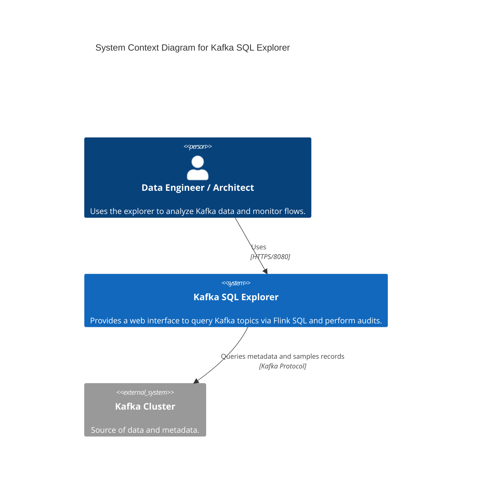
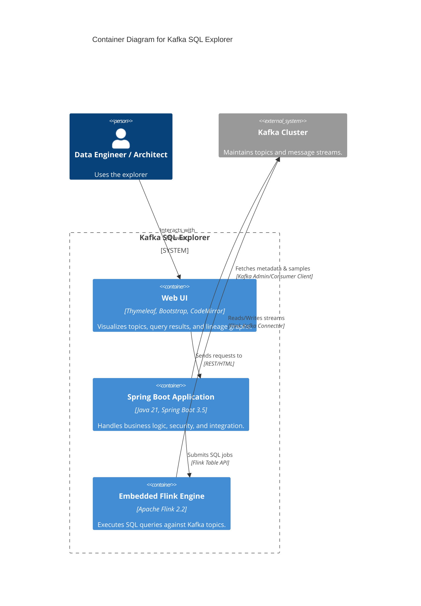
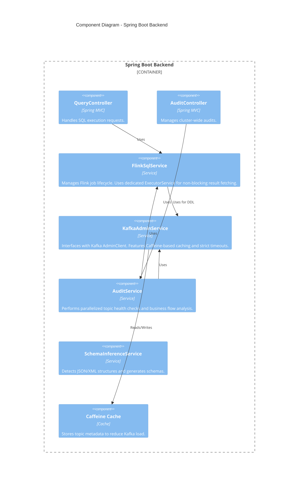

# Architecture - C4 Models

This document describes the architecture of Kafka SQL Explorer using the C4 model.

## 1. System Context Diagram

## 2. Container Diagram

## 3. Component Diagram (Spring Boot Application)

## Key Architectural Decisions (Robustness & Performance)

- **Parallel Auditing**: `AuditService` uses `CompletableFuture` to audit multiple topics concurrently, significantly speeding up cluster-wide reports.
- **Asynchronous SQL Fetching**: `FlinkSqlService` uses a dedicated `ExecutorService` to fetch streaming results, ensuring that Spring's worker threads are never blocked by infinite Flink iterators.
- **Metadata Caching**: `KafkaAdminService` utilizes Caffeine to cache topic lists and descriptors, improving UI responsiveness and reducing pressure on Kafka brokers.
- **Safe XML Processing**: `XmlExtractUDF` caches compiled `XPathExpression` instances while maintaining strict XXE protection.
- **Strict Timeouts**: All interactions with the Kafka cluster and Flink engine have explicit timeouts to prevent the application from hanging.
