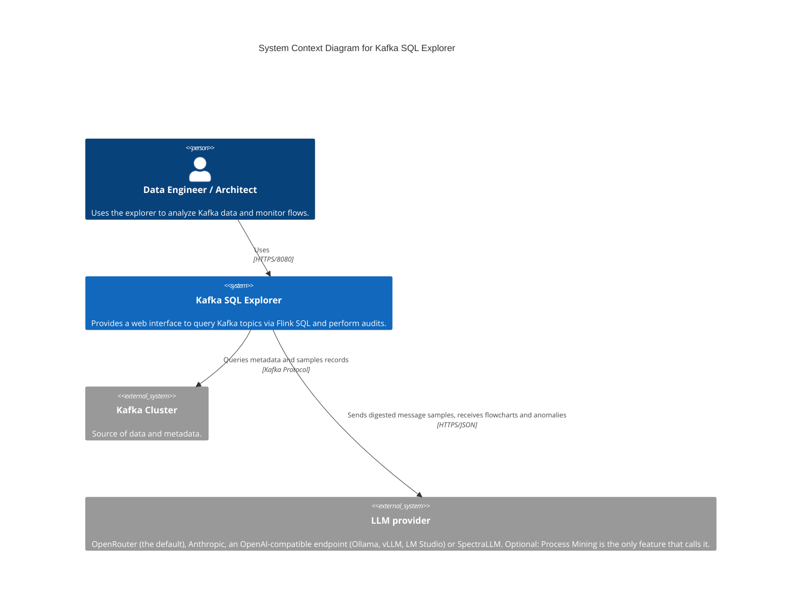
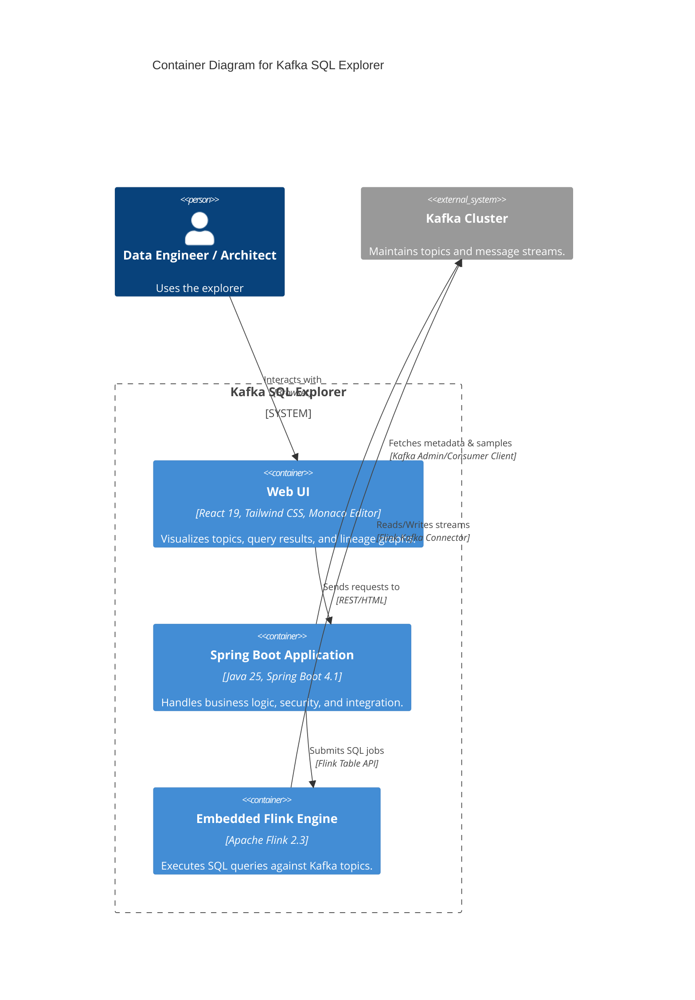
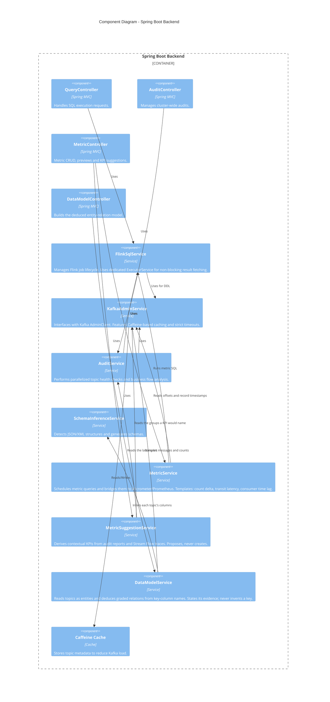

# Architecture - C4 Models

This document describes the architecture of Kafka SQL Explorer using the C4 model.

## 1. System Context Diagram

```mermaid
C4Context
    title System Context Diagram for Kafka SQL Explorer

    Person(user, "Data Engineer / Architect", "Uses the explorer to analyze Kafka data and monitor flows.")
    System(explorer, "Kafka SQL Explorer", "Provides a web interface to query Kafka topics via Flink SQL and perform audits.")
    System_Ext(kafka, "Kafka Cluster", "Source of data and metadata.")
    System_Ext(llm, "LLM provider", "OpenRouter (the default), Anthropic, an OpenAI-compatible endpoint (Ollama, vLLM, LM Studio) or SpectraLLM. Optional: Process Mining is the only feature that calls it.")

    Rel(user, explorer, "Uses", "HTTPS/8080")
    Rel(explorer, kafka, "Queries metadata and samples records", "Kafka Protocol")
    Rel(explorer, llm, "Sends digested message samples, receives flowcharts and anomalies", "HTTPS/JSON")
```

The LLM is drawn here because it is the boundary a reader most needs to see: it is the only
component of this diagram that can sit outside your network, and what crosses it is *digested*
samples — mapped fields, payload skeletons and bounded previews, never raw topics. Point it at a
loopback address (Ollama, SpectraLLM) and nothing leaves the host at all. **The shipped default
does not**: it is OpenRouter, a hosted gateway, so out of the box this boundary is crossed — which
is why both the Process Mining page and Settings state which case applies, read from the resolved
address rather than from the provider's name. On OpenRouter the claim goes one step further than a
warning, because the routing layer can be told to exclude providers that retain what they are
sent (`claude.openrouter-data-collection`, `DENY` by default); everywhere else the policy belongs
to the endpoint's own terms and the UI says so instead of guessing.

## 2. Container Diagram

```mermaid
C4Container
    title Container Diagram for Kafka SQL Explorer

    Person(user, "Data Engineer / Architect", "Uses the explorer")

    System_Boundary(c1, "Kafka SQL Explorer") {
        Container(web_ui, "Web UI", "React 19, Tailwind CSS, Monaco Editor", "Visualizes topics, query results, and lineage graphs.")
        Container(spring_app, "Spring Boot Application", "Java 25, Spring Boot 4.1", "Handles business logic, security, and integration.")
        Container(flink_engine, "Embedded Flink Engine", "Apache Flink 2.3", "Executes SQL queries against Kafka topics.")
    }

    System_Ext(kafka, "Kafka Cluster", "Maintains topics and message streams.")

    Rel(user, web_ui, "Interacts with", "Browser")
    Rel(web_ui, spring_app, "Sends requests to", "REST/HTML")
    Rel(spring_app, flink_engine, "Submits SQL jobs", "Flink Table API")
    Rel(spring_app, kafka, "Fetches metadata & samples", "Kafka Admin/Consumer Client")
    Rel(flink_engine, kafka, "Reads/Writes streams", "Flink Kafka Connector")
```

## 3. Component Diagram (Spring Boot Application)

```mermaid
C4Component
    title Component Diagram - Spring Boot Backend

    Container_Boundary(api, "Spring Boot Backend") {
        Component(query_ctrl, "QueryController", "Spring MVC", "Handles SQL execution requests.")
        Component(audit_ctrl, "AuditController", "Spring MVC", "Manages cluster-wide audits.")
        Component(metric_ctrl, "MetricController", "Spring MVC", "Metric CRUD, previews and KPI suggestions.")
        Component(model_ctrl, "DataModelController", "Spring MVC", "Builds the deduced entity-relation model.")

        Component(flink_svc, "FlinkSqlService", "Service", "Manages Flink job lifecycle. Uses dedicated ExecutorService for non-blocking result fetching.")
        Component(kafka_svc, "KafkaAdminService", "Service", "Interfaces with Kafka AdminClient. Features Caffeine-based caching and strict timeouts.")
        Component(audit_svc, "AuditService", "Service", "Performs parallelized topic health checks and business flow analysis.")
        Component(inference_svc, "SchemaInferenceService", "Service", "Detects JSON/XML structures and generates schemas.")
        Component(metric_svc, "MetricService", "Service", "Schedules metric queries and bridges them to Micrometer/Prometheus. Templates: count delta, transit latency, consumer time lag.")
        Component(suggest_svc, "MetricSuggestionService", "Service", "Derives contextual KPIs from audit reports and Stream Flow traces. Proposes, never creates.")
        Component(model_svc, "DataModelService", "Service", "Reads topics as entities and deduces graded relations from key-column names. States its evidence; never invents a key.")

        Component(cache, "Caffeine Cache", "Cache", "Stores topic metadata to reduce Kafka load.")
    }

    Rel(query_ctrl, flink_svc, "Uses")
    Rel(audit_ctrl, audit_svc, "Uses")
    Rel(audit_svc, kafka_svc, "Uses")
    Rel(audit_svc, flink_svc, "Uses")
    Rel(flink_svc, kafka_svc, "Uses for DDL")
    Rel(kafka_svc, cache, "Reads/Writes")
    Rel(metric_ctrl, metric_svc, "Uses")
    Rel(metric_ctrl, suggest_svc, "Uses")
    Rel(metric_svc, flink_svc, "Runs metric SQL")
    Rel(metric_svc, kafka_svc, "Reads offsets and record timestamps")
    Rel(suggest_svc, audit_svc, "Reads the last report")
    Rel(suggest_svc, kafka_svc, "Reads the groups a KPI would name")
    Rel(model_ctrl, model_svc, "Uses")
    Rel(model_svc, inference_svc, "Infers each topic's columns")
    Rel(model_svc, kafka_svc, "Samples messages and counts")
```

## Key Architectural Decisions (Robustness & Performance)

- **Parallel Auditing**: `AuditService` uses `CompletableFuture` to audit multiple topics concurrently, significantly speeding up cluster-wide reports.
- **Asynchronous SQL Fetching**: `FlinkSqlService` uses a dedicated `ExecutorService` to fetch streaming results, ensuring that Spring's worker threads are never blocked by infinite Flink iterators.
- **Metadata Caching**: `KafkaAdminService` utilizes Caffeine to cache topic lists and descriptors, improving UI responsiveness and reducing pressure on Kafka brokers.
- **Safe XML Processing**: `XmlExtractUDF` caches compiled `XPathExpression` instances while maintaining strict XXE protection.
- **Dynamic SQL Hint Injection**: `FlinkSqlService` uses regex-based SQL manipulation to inject Flink SQL hints (`/*+ OPTIONS(...) */`) for per-query offset control, allowing users to switch between Earliest and Latest modes without altering table definitions.
- **Strict Timeouts**: All interactions with the Kafka cluster and Flink engine have explicit timeouts to prevent the application from hanging.
- **A Measurement That Failed Is Never Zero**: across consumer lag (records and time alike), an unread partition, an unreadable group or a spent budget produces `null` with its reason, not `0`. Zero is a claim — "caught up", "no backlog" — and published as a Prometheus gauge it silences the very alert the metric exists to raise. The API records (`PartitionLag`, `PartitionTimeLag`, `TopicTimeLag`) box every such field so the distinction survives to the UI and to the exporter.
- **Suggestions Rest On Observations**: `MetricSuggestionService` derives KPIs only from measurements that were actually taken — an audit report, a Stream Flow trace — carries the evidence and threshold basis with each proposal, and creates nothing: the operator previews and saves. Flow traces live in the browser, so the frontend sends them back in the request rather than the derivation rule being written twice, once per language.
